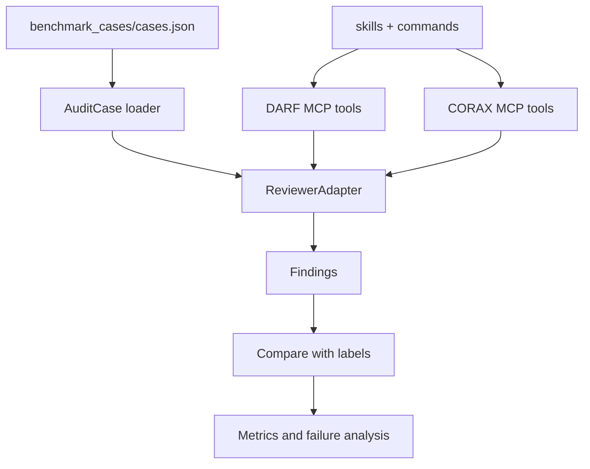
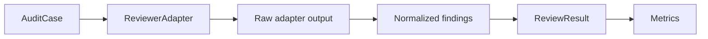

# DARF / CORAX 架构说明

## 总览

项目当前有两条线：

- benchmark 线：`src/quant_audit_benchmark/` 负责加载 case、运行 reviewer adapter、计算 precision / recall / F1。
- agent 线：`integrations/`、`skills/`、`commands/` 放入 DARF / CORAX 的完整审查机制，其中一部分已经通过 offline adapter 接到 benchmark。



## DARF 架构

DARF 是跨模型对抗审查框架。典型流程：

- Producer 产出研究内容。
- Workflow 生成 stripped blind brief，只保留事实、代码、数据和指标。
- Codex Challenger 只看 blind brief 和 rubric。
- Gate 根据 verdict 决定通过、返工、升级。
- 发现的问题写入 lessons DB，之后可用于自学习。

项目内位置：

- MCP server：`integrations/darf_mcp/`
- Skill：`skills/darf/`
- Command orchestration：`commands/darf.md`
- Portable config：`integrations/darf_mcp/config.py`

DARF 已经带有测试，当前 `integrations/darf_mcp/tests` 可跑通 103 个测试。

## CORAX 架构

CORAX 是 Codex-native 对抗审查框架。典型流程：

- Codex Producer 产出 phase output。
- `brief_stripper` 剥离结论，生成 blind brief。
- Codex Reviewer 在独立 context 中只看 blind brief。
- Reviewer PASS 后，Claude Sentinel 检查同模型 groupthink 和共同盲区。
- Gate 根据 Reviewer + Sentinel 做 advance、fix cycle、mutation ladder 或 escalate。

项目内位置：

- MCP server：`integrations/corax_mcp/`
- Skill：`skills/corax/`
- Schemas：`skills/corax/schemas/`
- Command orchestration：`commands/corax.md`
- Portable config：`integrations/corax_mcp/config.py`

CORAX 的 MCP 代码已经迁入并通过语法编译，但还需要补更完整的测试。

## 当前 benchmark adapter

当前 `src/quant_audit_benchmark/adapters/` 中有三个可运行 adapter：

- `single_llm_baseline`
- `darf`
- `corax`

`single_llm_baseline` 是 deterministic baseline。`darf` 会调用 DARF MCP normalization scan。`corax` 会调用 CORAX lookahead scan、normalization scan 和 blind brief stripper。三者都输出统一的 `ReviewResult`：



## 运行时数据

所有运行时数据都应该写入 `.runtime/` 或通过环境变量指定路径。

不应该写入：

- 个人 Claude / Codex 配置目录
- repo 外部 DB
- repo 外部日志
- API key 或 `.env`

## 下一步接口建议

已经新增：

```text
src/quant_audit_benchmark/
  adapters/
    base.py
    darf.py
    corax.py
    deterministic.py
    registry.py
  runner.py
```

核心接口可以是：

```python
class ReviewerAdapter:
    def review(self, case: AuditCase) -> ReviewResult:
        ...
```

这样 benchmark 可以不关心底层是 regex、LLM API、Codex CLI、DARF MCP，还是 CORAX Sentinel。
