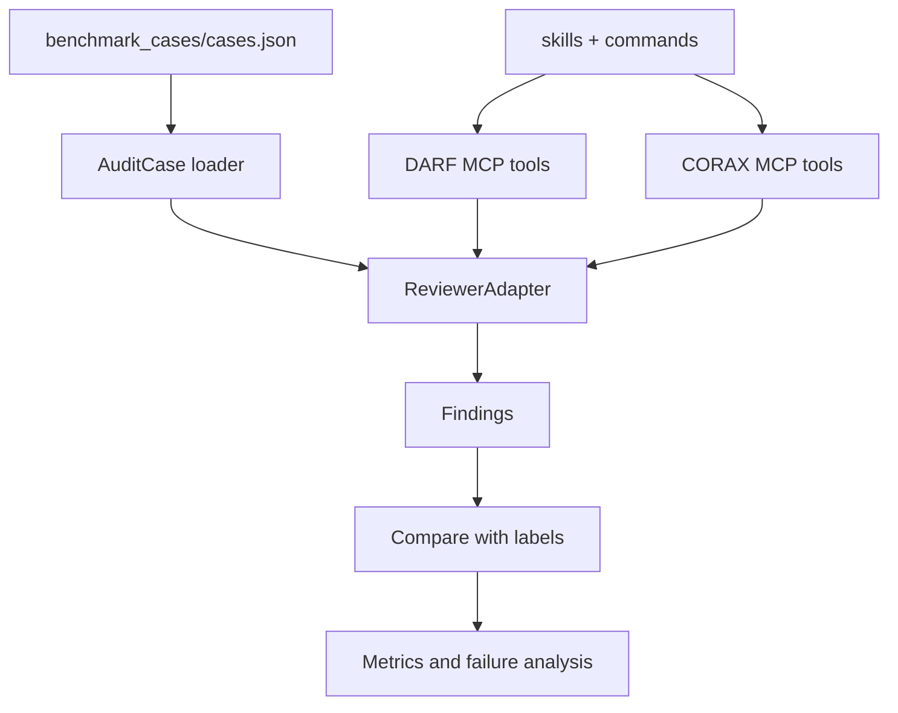
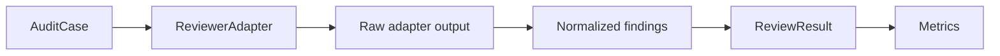

# DARF / CORAX Architecture

## Overview

The repository has two connected layers:

- Benchmark layer: `src/quant_audit_benchmark/` loads cases, runs reviewer adapters, and computes precision / recall / F1.
- Agent layer: `integrations/`, `skills/`, and `commands/` contain the DARF/CORAX review mechanisms. Parts of this layer are connected to the benchmark through offline and live adapters.



## DARF Architecture

DARF is a cross-model adversarial review framework.

Typical flow:

- A producer creates research output.
- The workflow strips conclusions into a blind brief that keeps facts, code, data, and metrics.
- A Codex challenger reviews only the blind brief and rubric.
- A gate decides whether to advance, fix, escalate, or record warnings.
- Useful failures are written into a lessons DB for later reuse.

Project locations:

- MCP server: `integrations/darf_mcp/`
- Skill: `skills/darf/`
- Command orchestration: `commands/darf.md`
- Portable config: `integrations/darf_mcp/config.py`

DARF currently has a runnable test suite under `integrations/darf_mcp/tests`.

## CORAX Architecture

CORAX is a Codex-native adversarial review framework.

Typical flow:

- A Codex Producer creates phase output.
- `brief_stripper` removes conclusion framing and creates a blind brief.
- A Codex Reviewer audits the blind brief in an isolated context.
- After reviewer PASS, Claude Sentinel checks for same-family groupthink and shared blind spots.
- The gate decides whether to advance, enter a fix cycle, climb the mutation ladder, or escalate.

Project locations:

- MCP server: `integrations/corax_mcp/`
- Skill: `skills/corax/`
- Schemas: `skills/corax/schemas/`
- Command orchestration: `commands/corax.md`
- Portable config: `integrations/corax_mcp/config.py`

CORAX MCP code has been migrated and compiles, but it still needs a fuller test suite.

## Benchmark Adapters

`src/quant_audit_benchmark/adapters/` currently includes five adapters:

- `single_llm_baseline`
- `darf`
- `corax`
- `corax-live`
- `darf-live`

`single_llm_baseline` is a deterministic baseline. `darf` calls the DARF normalization scan. `corax` calls CORAX lookahead scan, normalization scan, and blind brief stripper. `corax-live` and `darf-live` call local Codex-backed live reviewers and store raw artifacts.

All adapters normalize into the same `ReviewResult` shape:



## Runtime Data

Runtime output should be written to `.runtime/` or to paths configured through environment variables.

The project should not write to:

- Personal Claude/Codex configuration directories.
- External DB paths.
- External log paths.
- API keys or `.env` files.

## Core Interface

The benchmark layer depends on a small adapter interface:

```python
class ReviewerAdapter:
    def review(self, case: AuditCase) -> ReviewResult:
        ...
```

This keeps the benchmark independent from whether the underlying reviewer is a regex baseline, deterministic MCP tool, Codex CLI call, DARF challenger, or CORAX Sentinel path.
