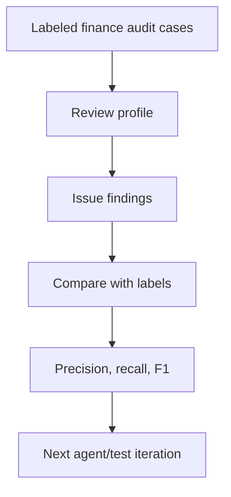

# DARF / CORAX 架构说明

## DARF

DARF 是跨模型对抗审查框架。一个模型负责产出研究内容，流程把结论性文字剥离成 blind brief，再交给另一个 challenger 按 rubric 审查。

这里的 `darf_cross_model` profile 对应这个思路：审查器要比单次 LLM review 更严格，重点找 counterarguments、leakage 和缺失的 evaluation evidence。

## CORAX

CORAX 是 Codex-native 的对抗审查框架。Codex Producer 负责产出，另一个独立 Codex Reviewer 在隔离上下文里审查 blind brief，再由 Claude Sentinel 检查同模型 groupthink 和共同盲区。

这里的 `corax_santa_sentinel` profile 对应这个思路：先做正常审查，再加一层 meta-review，特别看 reviewer 有没有漏掉 unsupported claim 或方法论问题。

## 为什么没有直接复制完整本地实现

本地 DARF / CORAX 实现里有个人机器路径、MCP wiring、debug log、runtime state 和本地 DB。这里先整理成一个干净的项目骨架，需要看完整实现时按 `docs/local_darf_corax_map.md` 找对应路径。

## 当前流程

