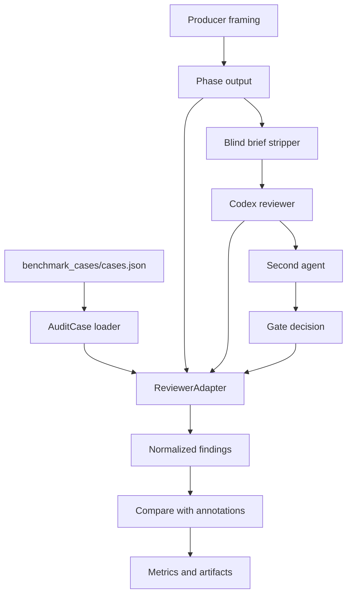

# CORAX Architecture

## Overview

The repository has three layers:

- Benchmark layer: `src/quant_audit_benchmark/` loads cases, runs adapters, computes metrics, and writes run artifacts.
- CORAX agent layer: `integrations/corax_mcp/`, `skills/corax/`, and `commands/corax.md` contain blind-brief, reviewer, second-agent, gate, mutation, and lesson logic.
- Supporting DARF layer: `integrations/darf_mcp/`, `skills/darf/`, and `commands/darf.md` remain available for comparison and shared infrastructure, but the current project framing is CORAX-first.



## CORAX Main Path

The main live adapter is `corax-ablation`.

It builds a producer-style phase output from a case and a producer claim. Depending on the selected condition, it either sends that phase output directly to the reviewer or first passes it through `integrations/corax_mcp/workspace/brief_stripper.py`.

The reviewer is the Codex Santa Method wrapper in `integrations/corax_mcp/reviewer/codex_santa.py`. It returns schema-shaped JSON with a verdict, issue list, confidence, and counter-arguments.

When a second agent is enabled, the adapter either calls a second Codex meta-reviewer or calls `integrations/corax_mcp/sentinel/claude_sentinel.py` with the reviewer verdict and review material excerpt. The second-agent result affects the gate decision:

- reviewer errors become `ERROR`,
- reviewer findings become `FAIL`,
- clean reviewer output becomes `PASS`,
- second-agent errors or high groupthink risk become `NEEDS_REVIEW`,
- second-agent hard veto becomes `FAIL`.

## Ablation Conditions

| Condition | Second agent | Blind brief? | Current status |
|---|---|---:|---|
| `single_llm` | none | no | baseline |
| `codex_codex` | Codex meta-reviewer | yes | runnable now |
| `codex_claude` | Claude Sentinel | yes | run after Claude quota resets |

This is the project mechanism under test. The previous offline adapter comparison remains a component benchmark and reproducibility check.

## Adapter Interface

All adapters normalize into the same shape:

```python
class ReviewerAdapter:
    def review(self, case: AuditCase) -> ReviewResult:
        ...
```

`ReviewResult` contains:

- `reviewer`: adapter name,
- `findings`: normalized issue findings,
- `raw_output`: adapter-specific artifact details.

The runner compares `findings` to `benchmark_cases/annotations.json`.

## Public Adapters

- `single_llm_baseline`: deterministic naive rule baseline.
- `darf`: offline DARF scanner-backed adapter.
- `corax`: offline CORAX scanner-backed adapter with blind-brief stripping.
- `corax-live`: single-pass live Codex reviewer.
- `darf-live`: live DARF challenger path.
- `corax-ablation`: main CORAX ablation path.

The default CLI run uses only the offline adapters. Live adapters require local CLI credentials.

## Runtime Artifacts

`corax-ablation` writes:

```text
.runtime/runs/<run-id>/corax-ablation/<condition>/<case-id>/phase-output.md
.runtime/runs/<run-id>/corax-ablation/<condition>/<case-id>/blind-brief.md
.runtime/runs/<run-id>/corax-ablation/<condition>/<case-id>/artifact.json
.runtime/runs/<run-id>/corax-ablation/<condition>/<case-id>/codex-meta-review.json
.runtime/runs/<run-id>/corax-ablation/<condition>/<case-id>/sentinel/sentinel-summary.json
.runtime/runs/<run-id>/results-<condition>.json
```

Runtime data should stay in `.runtime/` or in configured runtime paths. Do not commit unreviewed runtime output, credentials, personal Claude/Codex configuration, local logs, or local SQLite databases.

## Configuration

Personal paths are controlled by environment variables. The most relevant live-run variables are:

- `QUANT_AUDIT_CODEX_RESOURCE_DIR`,
- `QUANT_AUDIT_LIVE_MODEL`,
- `QUANT_AUDIT_SENTINEL_MODEL`,
- `CORAX_DATA_DIR`,
- `CORAX_SKILL_DIR`,
- `CORAX_LESSONS_DB_PATH`.

See `CONFIGURATION.md` for detailed setup notes.
